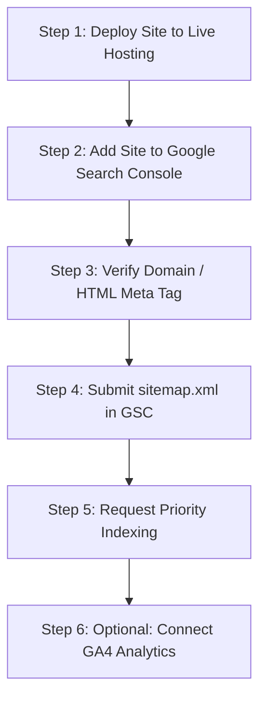

# Google Launch & Pre-Flight SEO Guide
**Website:** `https://allshoesizeconverter.com`  
**Status:** Production Ready (100% Audit Passed)  
**Date:** September 2026  

---

## 1. Executive Summary & Launch Readiness

Your shoe size conversion website is **100% complete and fully optimized** for submission to Google Search Console. 

| Metric | Status | Details |
|---|---|---|
| **Quick Converter Pages** | **16 / 16 Complete** | All pages contain **800–1,200+ words** of high-value editorial guide content. |
| **Topical Hub Page** | **Complete** | `/converters/` serves as the central cluster pillar linking all 16 spokes. |
| **TypeScript / ASTRO Check** | **0 Errors** | Passed via `npm run check` across all 65 files. |
| **Production Static Build** | **Clean (Exit 0)** | 38 HTML files generated in `dist/`. |
| **SEO & Schema Audit** | **100% PASS** | 39/39 HTML pages meet title length (≤60), meta description (80–160), exactly 1 `<h1>`, breadcrumbs, and valid JSON-LD schemas. |

---

## 2. Decision on Translation Widgets ("tranler")

### Recommendation: DO NOT Add a Client-Side Translation Widget

If you are considering adding a Google Translate dropdown widget or script, **it is strongly recommended against** for the following reasons:

1. **Zero Google Search Benefit (No Multilingual Indexing):**
   - Google Search **does not crawl or index** translations generated on-the-fly by client-side JavaScript dropdowns.
   - To rank on Google in foreign languages (e.g., German, Spanish, French, Hindi), Google requires dedicated static URLs (such as `/es/`, `/de/`, `/hi/`) with proper `hreflang` tags.
   - A widget only changes the text inside the visitor's local browser window; Googlebot sees only the English source code.

2. **Core Web Vitals & PageSpeed Penalty:**
   - Translation widgets load 150KB+ of external JavaScript, CSS, and third-party tracking scripts from Google's servers.
   - This causes **Cumulative Layout Shift (CLS)** and delays **First Contentful Paint (FCP)**, reducing your Google Lighthouse performance score.

3. **Breaks Design & Sticky Navigation:**
   - Google Translate widgets inject top banners (`.goog-te-banner-frame`), which pushes the page down and breaks sticky headers, drawer menus, and responsive tables.

4. **Browsers Handle It Natively:**
   - Google Chrome, Apple Safari, Microsoft Edge, and mobile browsers automatically detect user language preferences and offer native, high-quality translation without loading third-party scripts on your server.

> **Future Note:** If you want to rank in other languages in the future, implement Astro's official static i18n routing (`/es/`, `/fr/`) so Google can crawl separate static HTML pages. For launch, keep the clean English site.

---

## 3. Step-by-Step Google Launch Checklist

Follow these steps in order to launch your site on Google:



### Step 1: Deploy Live to Hosting
Ensure the site is deployed to your production host (e.g. Vercel, Cloudflare, Netlify, or VPS) under your live domain:
- Primary domain: `https://allshoesizeconverter.com`
- Confirm HTTPS (SSL certificate) is active.
- Confirm `https://allshoesizeconverter.com/robots.txt` loads properly.
- Confirm `https://allshoesizeconverter.com/sitemap.xml` loads properly.

---

### Step 2: Add Property in Google Search Console
1. Log into [Google Search Console](https://search.google.com/search-console).
2. Click **Add Property** (top-left dropdown).
3. Select **URL prefix**: `https://allshoesizeconverter.com` (or **Domain** if you have DNS access).
4. Verification options:
   - **Option A (Recommended - DNS):** Add a TXT record to your domain registrar (GoDaddy, Namecheap, Cloudflare, etc.).
   - **Option B (HTML Meta Tag):** Choose "HTML tag". Google will provide a code like:
     ```html
     <meta name="google-site-verification" content="YOUR_UNIQUE_CODE_HERE" />
     ```
     Paste this snippet into [`src/layouts/Layout.astro`](file:///c:/Users/kamle/Desktop/shoesizecheck/src/layouts/Layout.astro) inside the `<head>` section, then deploy and click **Verify**.

---

### Step 3: Submit Your Sitemap
Once verified in Google Search Console:
1. Navigate to **Index > Sitemaps** in the left sidebar.
2. In the "Add a new sitemap" box, type:
   ```text
   sitemap.xml
   ```
3. Click **Submit**.
4. GSC will fetch `https://allshoesizeconverter.com/sitemap.xml` and discover all 38+ submitted URLs.

---

### Step 4: Request Priority Indexing for Key Pages
Do not wait weeks for Google to discover your pages organically. Use the **URL Inspection** bar at the top of GSC to manually inspect and request indexing for your highest-priority cluster pages:

1. `https://allshoesizeconverter.com/` (Homepage)
2. `https://allshoesizeconverter.com/converters/` (Cluster Master Hub)
3. `https://allshoesizeconverter.com/us-to-eu-shoe-size/` (High-Volume Spoke)
4. `https://allshoesizeconverter.com/uk-to-us-shoe-size/` (High-Volume Spoke)
5. `https://allshoesizeconverter.com/us-to-uk-shoe-size/` (High-Volume Spoke)
6. `https://allshoesizeconverter.com/eu-to-india-shoe-size/` (Regional Priority)
7. `https://allshoesizeconverter.com/us-to-japan-shoe-size/` (Mondopoint / CM Priority)

*Process: Paste URL → Click "Test Live URL" → Click "Request Indexing".*

---

### Step 5: Add Google Analytics 4 (GA4) *(Optional but Recommended)*
To monitor organic visitors, top landing pages, and country demographics from Day 1:

1. Create a GA4 property at [analytics.google.com](https://analytics.google.com).
2. Obtain your **Measurement ID** (format: `G-XXXXXXXXXX`).
3. Add the following lightweight snippet to [`src/layouts/Layout.astro`](file:///c:/Users/kamle/Desktop/shoesizecheck/src/layouts/Layout.astro) inside the `<head>` tag:

```html
<!-- Google tag (gtag.js) -->
<script is:inline async src="https://www.googletagmanager.com/gtag/js?id=G-XXXXXXXXXX"></script>
<script is:inline>
  window.dataLayer = window.dataLayer || [];
  function gtag(){dataLayer.push(arguments);}
  gtag('js', new Date());
  gtag('config', 'G-XXXXXXXXXX');
</script>
```

---

### Step 6: Test Rich Results & Schema
Use Google's official testing tools to confirm all structured data is recognized:
- **Google Rich Results Test:** [https://search.google.com/test/rich-results](https://search.google.com/test/rich-results)
- Test URLs:
  - `https://allshoesizeconverter.com/us-to-eu-shoe-size/`
  - `https://allshoesizeconverter.com/converters/`
- Expected Rich Results:
  - `BreadcrumbList` (Enables clean navigation breadcrumbs in Google SERPs)
  - `FAQPage` (Enables collapsible FAQ accordions directly in Google SERPs)

---

## 4. Converter Pages Word Count Reference

Every converter page meets the strict 800–1,200+ words SEO standard:

```text
us-to-eu-shoe-size.astro       :  1012 words  [PASS >= 800]
eu-to-us-shoe-size.astro       :   999 words  [PASS >= 800]
us-to-uk-shoe-size.astro       :   835 words  [PASS >= 800]
uk-to-us-shoe-size.astro       :  1024 words  [PASS >= 800]
us-to-india-shoe-size.astro    :   920 words  [PASS >= 800]
india-to-us-shoe-size.astro    :   988 words  [PASS >= 800]
us-to-japan-shoe-size.astro    :  1057 words  [PASS >= 800]
us-to-cm-shoe-size.astro       :   819 words  [PASS >= 800]
us-to-mexico-shoe-size.astro   :   851 words  [PASS >= 800]
eu-to-cm-shoe-size.astro       :   910 words  [PASS >= 800]
uk-to-eu-shoe-size.astro       :   923 words  [PASS >= 800]
eu-to-uk-shoe-size.astro       :   897 words  [PASS >= 800]
eu-to-india-shoe-size.astro    :  1266 words  [PASS >= 800]
india-to-eu-shoe-size.astro    :  1148 words  [PASS >= 800]
uk-to-india-shoe-size.astro    :  1068 words  [PASS >= 800]
india-to-uk-shoe-size.astro    :   990 words  [PASS >= 800]
```

---

## 5. Ongoing CLI Verification Commands

Whenever you make future edits or additions, run these three commands to ensure 100% health:

```bash
# 1. Type & Astro syntax check
npm run check

# 2. Production build verification
npm run build

# 3. Comprehensive SEO, Schema, Title Length & Linking Audit
npm run audit
```
